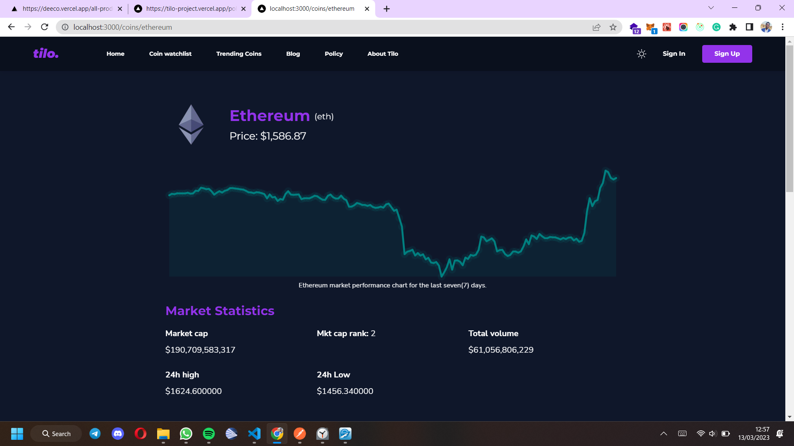
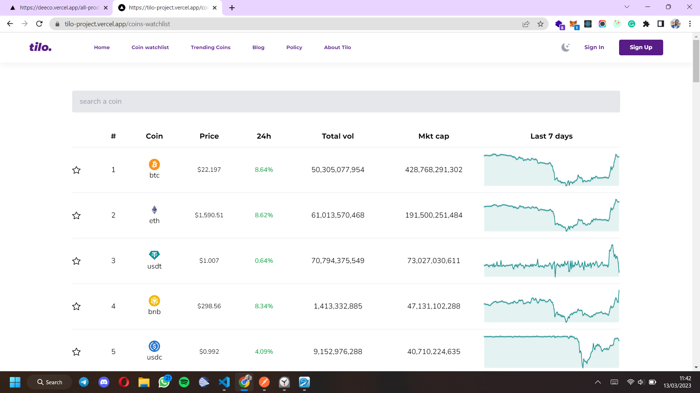
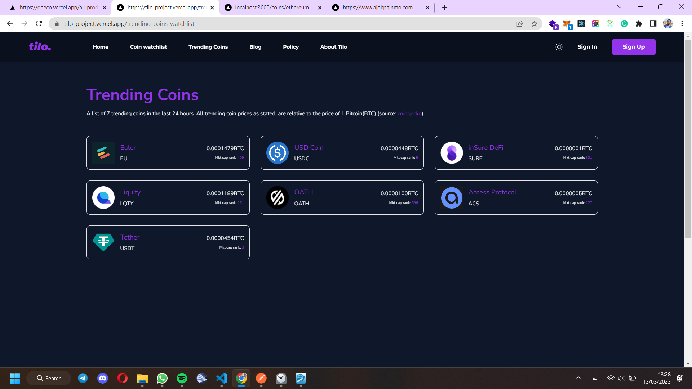
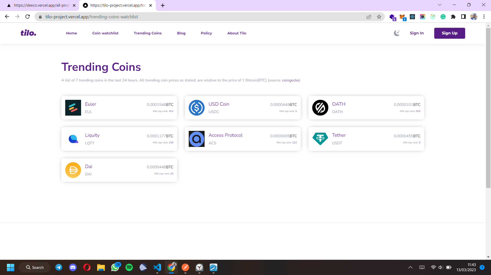
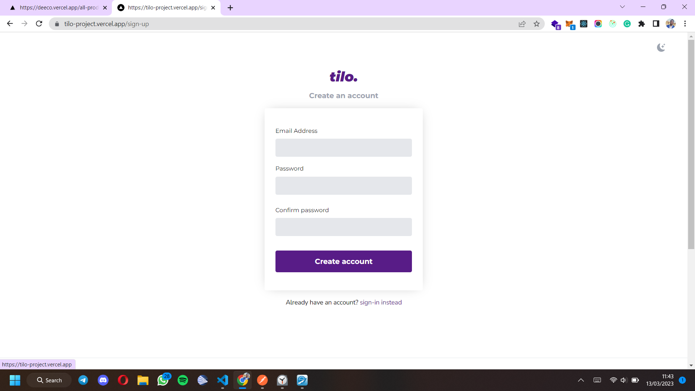
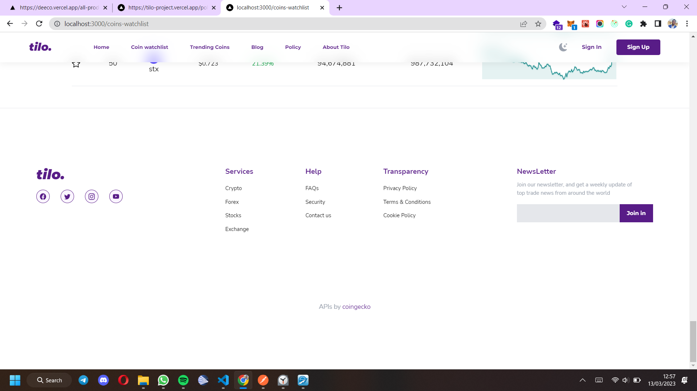
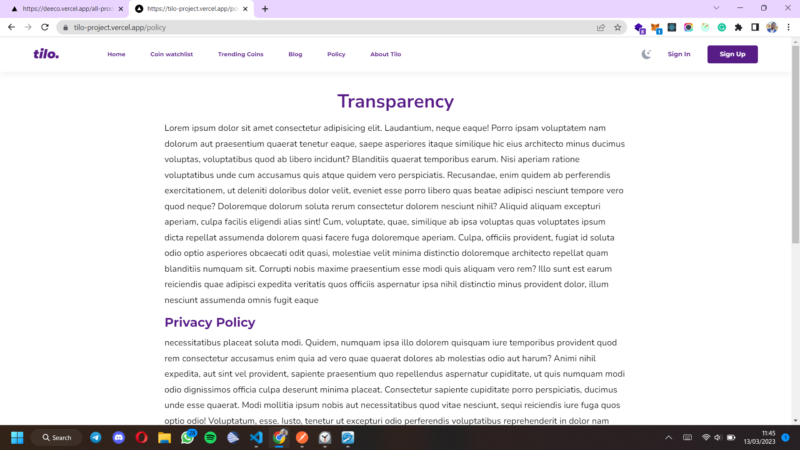

# About tilo

Tilo is a beautiful side-project I am working on. It's a crypto based project to aid cryptocurrency marketers and other cryto enthusiasts in watching and trading the market with ease, thanks to a user experience that is streamlined towards simplicity and efficiency.

It will provide a base for traders to watch the market(top 50 coins), keep an eye on trending coins, be able to swap crypto coins/tokens, and more.

For now, only most of the front-end aspect is ready. In the next iteration of the project, I hope to complete it into a full stack project with a coin/token swap included - hence powering it up with blockchain/web3 capabilities.

## Main build stack/technologies used.

Below is a list of the main awesome technologies that I used/will be using on the project.

- current

1. NextJS
2. Tailwind CSS
3. Crypto APIs (thanks to coingecko)

- extras - coming up for the new features

1. NodeJS
2. ExpressJs
3. MongoDB
4. Mongoose ODM
5. Moralis + Metamask etc.

## Live site

> The project is hosted live. You can explore it via this link - https://tilo-project.vercel.app.

<!-- ## Live demo

> You can watch a live demo of the project here - https://www.awesomescreenshot.com/video/13008461?key=e8314a86270462007152e3b172ec00aa - checkout the demo video to get wowed even further. -->

## Screenshots

Below are some awesome screenshots from tilo.
















## Setting up for development

Below, are some basic setups to help you set up a local development environment for the project.

### Client/Front-end

1. Open the project root directory with your code editor.

or use the command below.

```

cd tilo


```

> The root folder/directory contains the "client"/front-end part of the project.

2. Run the below command in the root folder to install all required dependencies for the front-end aspect of the project.

```

pnpm install


```

3. After running the above install command, run the following command to start the app in development mode.

```

pnpm run dev


```

> Please take note that package management in this project is done using PNPM not NPM.

> You might also need to do some more setups. If you ever get into any issues, just create a github issue, I'll respond as soon as possible. I'll also be just a twitter DM, a call, or an email way.

- Twitter: https://twitter.com/AJ_Okpainmo

- Email: okpainmoandrew@gmail.com

- Phone: +234 90 5373 9194

> Cheers!!!
